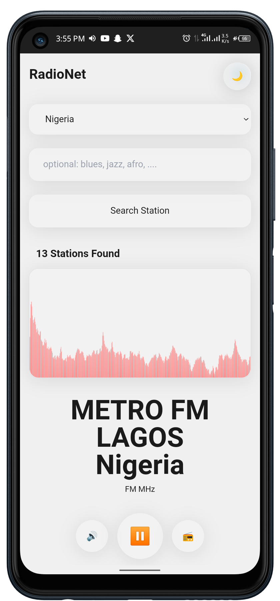
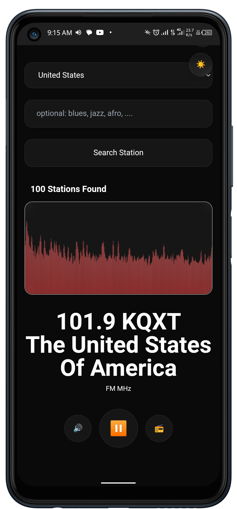

## 📻 RadioNet - Modern Radio Streaming App

<div align="center">

# 📻📡🛰️

**A beautiful, modern radio streaming app with real-time audio visualization**

[](https://kit.svelte.dev/)
[](https://www.typescriptlang.org/)
[](https://tailwindcss.com/)
[](https://web.dev/progressive-web-apps/)

[Live Demo](#) • [Documentation](#features) • [Installation](#installation) • [API](#api-integration)

</div>


## 🎨 Screenshots
<div align="center" style="display: flex; flex-direction: row;">



</div>


## ✨ Features

### 🎵 Core Functionality
- **Live Radio Streaming** - Stream thousands of radio stations worldwide via Radio Browser API
- **Real-time Audio Visualization** - Beautiful waveform visualizer using Web Audio API
- **Station Search** - Find stations by name, country, genre, or language
- **Favorites** - Save your favorite stations for quick access
- **Volume Control** - Smooth volume adjustment with persistent settings

### 🎨 User Interface
- **Glassmorphic Design** - Modern UI with backdrop blur and translucent elements
- **Dark/Light Themes** - Seamless theme switching with smooth transitions
- **Responsive Layout** - Mobile-first design that works on all devices
- **Touch Gestures** - Swipe and drag interactions for mobile users
- **Smooth Animations** - Svelte transitions for delightful UX

### 🚀 Progressive Web App
- **Installable** - Add to home screen on mobile and desktop
- **Offline Support** - Service worker caching for core functionality
- **Background Playback** - Continue listening while browsing
- **Media Controls** - System media controls integration
- **Push Notifications** - Optional alerts for favorite stations (future)

### 🔧 Developer Features
- **Svelte 5 Runes** - Modern reactivity with signals ($state, $derived)
- **TypeScript** - Full type safety across the codebase
- **SEO Optimized** - Meta tags, Open Graph, structured data
- **Embed API** - Generate embeddable players for external sites
- **Modular Architecture** - Clean component and store structure

---

## 📋 Table of Contents

- [Installation](#installation)
- [Project Structure](#project-structure)
- [API Integration](#api-integration)
- [Usage Guide](#usage-guide)
- [Configuration](#configuration)
- [Development](#development)
- [Deployment](#deployment)
- [Contributing](#contributing)
- [License](#license)

---

## 🚀 Installation

### Prerequisites

- **Node.js** 18.x or higher
- **npm** or **pnpm** or **yarn**
- Modern browser with Web Audio API support

### Quick Start

```bash
# Clone the repository
git clone https://github.com/yourusername/radio-player.git
cd radio-player

# Install dependencies
npm install

# Start development server
npm run dev

# Open browser to http://localhost:5173
```


## 📁 Project Structure

```
radio-player/
├── src/
│   ├── lib/
│   │   ├── stores/
│   │   │   ├── theme.svelte.ts          # Theme management (dark/light)
│   │   │   ├── audio.svelte.ts          # Audio player state & controls
│   │   │   └── preferences.svelte.ts     # User preferences & favorites
│   │   ├── components/
│   │   │   ├── Visualizer.svelte        # Real-time audio waveform
│   │   │   ├── StationSelector.svelte   # Station browser/search
│   │   │   ├── VolumeControl.svelte     # Volume adjustment modal
│   │   │   └── Modal.svelte             # Reusable modal component
│   │   └── utils/
│   │       ├── audio.ts                 # Web Audio API helpers
│   │       ├── storage.ts               # localStorage utilities
│   │       └── radioBrowser.ts          # Radio Browser API integration
│   ├── routes/
│   │   ├── +layout.svelte               # Global layout with theme
│   │   ├── +page.svelte                 # Main player interface
│   │   ├── settings/
│   │   │   └── +page.svelte             # Settings & favorites
│   │   └── embed.js/
│   │       └── +server.ts               # Embed API endpoint
│   ├── app.css                          # Global styles & glassmorphic classes
│   └── app.html                         # HTML template with PWA tags
├── static/
│   ├── manifest.json                    # PWA manifest
│   ├── icon-*.png                       # PWA icons (various sizes)
│   └── favicon.png                      # Browser favicon
├── svelte.config.js                     # SvelteKit configuration
├── vite.config.ts                       # Vite + PWA plugin config
├── tailwind.config.js                   # Tailwind CSS configuration
├── tsconfig.json                        # TypeScript configuration
└── package.json                         # Project dependencies
```

---

## 🔌 API Integration

This project uses the **Radio Browser API** to fetch live radio stations from around the world.

### Radio Browser API Setup

```typescript
// src/lib/utils/radioBrowser.ts
import { RadioBrowserApi } from 'radio-browser-api';

// Initialize API client
export const radioBrowserApi = new RadioBrowserApi('YourAppName');

// Search stations
export async function searchStations(query: string) {
  try {
    const stations = await radioBrowserApi.searchStations({
      name: query,
      limit: 20,
      order: 'votes',
      reverse: true
    });
    return stations;
  } catch (error) {
    console.error('Failed to search stations:', error);
    return [];
  }
}

// Get top stations
export async function getTopStations(limit = 50) {
  try {
    const stations = await radioBrowserApi.getStationsTopVote(limit);
    return stations;
  } catch (error) {
    console.error('Failed to fetch top stations:', error);
    return [];
  }
}

// Get stations by country
export async function getStationsByCountry(country: string) {
  try {
    const stations = await radioBrowserApi.searchStations({
      country,
      limit: 50,
      order: 'votes',
      reverse: true
    });
    return stations;
  } catch (error) {
    console.error('Failed to fetch stations by country:', error);
    return [];
  }
}
```

### Example Usage

```svelte
<script lang="ts">
  import { audio } from '$lib/stores/audio.svelte';
  import { searchStations } from '$lib/utils/radioBrowser';

  async function handleStationSelect(station) {
    // Set the station URL and name
    audio.setStationUrl(station.url_resolved, station.name);
    
    // Start playback
    audio.togglePlay();
  }

  async function search(query: string) {
    const results = await searchStations(query);
    // Display results
  }
</script>
```

---

## 📖 Usage Guide

### Basic Usage

1. **Search for Stations**
   - Use the search bar to find stations by name, genre, or location
   - Browse popular stations in the station selector
   - Filter by country, language, or tags

2. **Play a Station**
   - Click on a station from search results
   - Press the play button to start streaming
   - Visualizer will animate with the audio

3. **Control Playback**
   - **Play/Pause**: Click the center button
   - **Volume**: Click the volume icon to adjust
   - **Station Info**: View current station details

4. **Save Favorites**
   - Click the heart icon on any station
   - Access favorites from the settings page
   - Quick access to your preferred stations

5. **Switch Themes**
   - Click the moon/sun icon in the top-right
   - Theme preference is saved automatically
   - Smooth transitions between modes

### Advanced Features

#### Keyboard Shortcuts

```
Space       - Play/Pause
↑ / ↓       - Volume Up/Down
← / →       - Previous/Next Favorite
M           - Mute/Unmute
F           - Open Favorites
S           - Open Search
T           - Toggle Theme
```


#### Mobile App Installation

##### iOS (Safari)
1. Open the app in Safari
2. Tap the Share button
3. Select "Add to Home Screen"
4. Tap "Add"

##### Android (Chrome)
1. Open the app in Chrome
2. Tap the menu (⋮)
3. Select "Install app" or "Add to Home screen"
4. Tap "Install"

##### Desktop (Chrome/Edge)
1. Look for the install icon in the address bar
2. Click "Install RadioNet"
3. App opens in standalone window

---


### Custom Configuration

#### Change Default Settings

```typescript
// src/lib/stores/preferences.svelte.ts
class PreferencesStore {
  defaultVolume = $state(0.7);        // 0.0 - 1.0
  defaultTheme = $state('dark');       // 'light' | 'dark' | 'system'
  favoriteStations = $state([]);       // Array of station objects
  autoplay = $state(false);            // Auto-start playback
  visualizerEnabled = $state(true);    // Show/hide visualizer
  
  // Add custom preferences
  preferredLanguage = $state('en');
  preferredCountry = $state('US');
}
```

---

## 🛠️ Development

### Development Server

```bash
# Start dev server with hot reload
npm run dev

# Start on specific port
npm run dev -- --port 3000

# Start with network access
npm run dev -- --host
```

### Building

```bash
# Build for production
npm run build

# Preview production build
npm run preview

# Type check
npm run check

# Lint code
npm run lint

# Format code
npm run format
```

---

## 🚢 Deployment

### Vercel (Recommended)

```bash
# Install Vercel CLI
npm i -g vercel

# Deploy
vercel --prod
```

Or connect your Git repository:
1. Go to [vercel.com](https://vercel.com)
2. Import your Git repository
3. Vercel auto-detects SvelteKit
4. Deploy with one click

### Netlify

```bash
# Install Netlify CLI
npm i -g netlify-cli

# Build
npm run build

# Deploy
netlify deploy --prod --dir=build
```

Or use Netlify UI:
1. Connect Git repository
2. Build command: `npm run build`
3. Publish directory: `build`
4. Deploy

### Docker

```dockerfile
# Dockerfile
FROM node:20-alpine AS builder
WORKDIR /app
COPY package*.json ./
RUN npm ci
COPY . .
RUN npm run build

FROM node:20-alpine
WORKDIR /app
COPY --from=builder /app/build ./build
COPY --from=builder /app/package*.json ./
RUN npm ci --production
EXPOSE 3000
ENV NODE_ENV=production
CMD ["node", "build"]
```

```bash
# Build and run
docker build -t radio-player .
docker run -p 3000:3000 radio-player
```

### Static Hosting

For static hosting (GitHub Pages, Cloudflare Pages, etc.):

```bash
# Build static site
npm run build

# Upload the 'build' folder to your hosting provider
```

---

## 🧪 Testing Checklist

Before deploying, verify:

- [ ] All stations load and play correctly
- [ ] Search functionality works
- [ ] Favorites save and persist
- [ ] Theme toggle works smoothly
- [ ] Visualizer animates with audio
- [ ] Volume control functions properly
- [ ] PWA is installable (check install prompt)
- [ ] Offline mode works (basic UI loads)
- [ ] Responsive on mobile, tablet, desktop
- [ ] No console errors
- [ ] SEO meta tags present
- [ ] Lighthouse score 90+ (Performance, Accessibility, Best Practices, SEO)
- [ ] Audio continues in background (mobile)
- [ ] System media controls work (mobile/desktop)

---

## 🤝 Contributing

Contributions are welcome! Please follow these steps:

1. **Fork the repository**
2. **Create a feature branch** (`git checkout -b feature/amazing-feature`)
3. **Commit your changes** (`git commit -m 'Add amazing feature'`)
4. **Push to branch** (`git push origin feature/amazing-feature`)
5. **Open a Pull Request**

### Contribution Guidelines

- Follow the existing code style
- Write meaningful commit messages
- Add tests for new features
- Update documentation as needed
- Ensure all tests pass before submitting

---

## 📝 License

This project is licensed under the MIT License - see the [LICENSE](LICENSE) file for details.

---

## 🙏 Acknowledgments

- **Radio Browser API** - Free radio station database
- **SvelteKit** - Amazing web framework
- **Tailwind CSS** - Utility-first CSS framework
- **Web Audio API** - Browser audio processing
- **MDN Web Docs** - Excellent documentation

---

## 📞 Support

- **Documentation**: [Full docs](https://github.com/loluwafemi/radionet)
- **Issues**: [Report bugs](https://github.com/loluwafemi/radionet)
- **Discussions**: [Community forum](https://github.com/loluwafemi/radionet)
- **Email**: shokefunfemi@gmail.com

---

## 🎯 Roadmap

### Version 1.1 (Next Release)
- [ ] Podcast support
- [ ] Sleep timer
- [ ] Equalizer controls
- [ ] Station recommendations
- [ ] User accounts (optional)

### Version 1.2
- [ ] Chromecast support
- [ ] Android Auto / CarPlay
- [ ] Multi-language support
- [ ] Advanced search filters
- [ ] Social sharing

### Version 2.0
- [ ] Recording functionality
- [ ] Playlist creation
- [ ] Cloud sync
- [ ] Desktop apps (Tauri)
- [ ] Premium features

---

## 📊 Browser Support

| Browser | Version | Status |
|---------|---------|--------|
| Chrome | 90+ | ✅ Fully Supported |
| Firefox | 88+ | ✅ Fully Supported |
| Safari | 15.4+ | ✅ Fully Supported |
| Edge | 90+ | ✅ Fully Supported |
| Opera | 76+ | ✅ Fully Supported |
| Samsung Internet | 14+ | ✅ Fully Supported |

---

## 🔒 Security

- All streams use HTTPS
- No user data collected
- localStorage for local preferences only
- Content Security Policy implemented
- Regular dependency updates

---

## ⚡ Performance

- Lighthouse Score: 95+
- First Contentful Paint: < 1s
- Time to Interactive: < 2s
- Bundle Size: < 200KB (gzipped)
- Service Worker caching
- Lazy loading components
- Optimized audio processing

---

<div align="center">

**Made with ❤️ using SvelteKit**

[⬆ Back to Top](#-radionet---modern-radio-streaming-app)

</div>